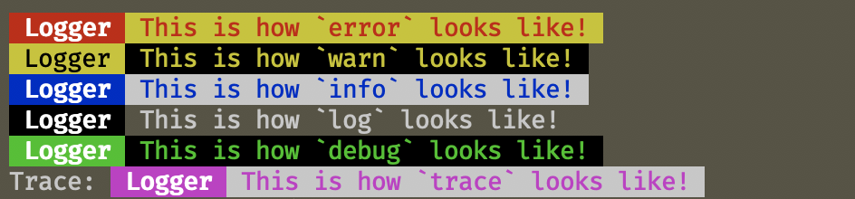

# This is `golc` 🌈📝
<sup><sup>(Since `clog` was taken)</sup></sup>


A *colorful* logging utility for **NodeJS** programs.



## Installation 📦

```sh
npm i --save golc
```

> It is *Production Ready️™* as in: I am using it in production

## Features 🍕

+ 6 **log levels** + disabling

+ customizable **color schemes** (via [`chalk`](https://github.com/chalk/chalk) API)

+ optional log **badges** (with *label* and *kind*)

## Usage 🚀

Import it
```javascript
const Golc = require('golc')
```

Make it
```javascript
const L = new Golc('MyLogger')
```

... Use it!
```javascript
function doTheJob() {
  try {
    job()
  } catch (e) {
    L.error(e)
  }

  L.info('Job done! 👍')
}
```

Make more!

```javascript
const BLog = new Golc('BeautifulLogger', {...})
const SLog = new Golc('ShyLogger', {...})
```

* * *
#### Suppressing logs

By default log levels are set basing on the environment you're running in.

`NODE_ENV=production` sets logs to `INFO` level, others will have all the logs enabled.

You can suppress logs of a certain level just by setting the `level` on your logger.
```javascript
L.level = L.ERROR // Will only log errors
```

Possible values are: `NONE`, `ERROR`, `WARN`, `INFO`, `LOG`, `DEBUG`, `TRACE`.

They go in order, so if you set `L.level = L.LOG`, you will get: `ERROR`, `WARN`, `INFO` and `LOG`.


> **Beware !!!**
>
>  If you're logging costly operations, wrap your logic in conditions like so:

```javascript
if (L.level >= L.INFO) {
  L.info(costlyOperation())
}
```

## Customization 🎛
The constructor accepts a label, which will be used to tag your logs, and an options object:

```javascript
const L = new Golc('Logger', options)
```

Where possible options are:

```javascript
{
  withLabel: true, // Label of the logger in the badge (It's name)
  withKind: false, // Kind of log in the badge (Error, Warn, ...)
  withNewline: false, // Put a newline between the badge and the message
  styles: {
    error: {
      badge: ['bgRed', 'bold'], // Badge styles
      message: ['red', 'bgYellow'] // Message styles
    },
    warn: {...},
    info: {...},
    log: {...},
    debug: {...},
    trace: {...}
  }
}
```

A style object it's really just an array containing the [`chalk`](https://github.com/chalk/chalk) options that you want to combine, as strings.

You can check how that works [right here](https://github.com/bugged-reality/golc/blob/master/index.js#L13)! 🔍👀

### License

[MIT](LICENSE)

### Contributions / Suggestions


[Welcome](https://github.com/bugged-reality/golc/pulls) and [welcome](https://github.com/bugged-reality/golc/issues)! 🤗

### Inspiration

[ulog](https://github.com/download/ulog)
